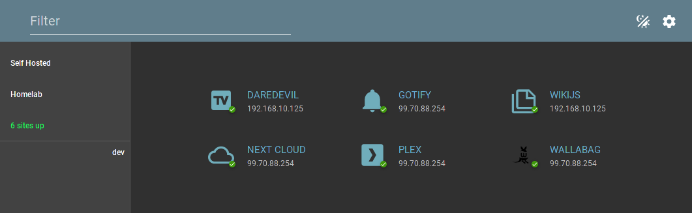

# Go-Simple-Startpage

This is an example app built with go and angular 11.

<!-- toc -->

- [Configuration](#configuration)
  * [Config.yaml](#configyaml)
  * [YAML configuration example](#yaml-configuration-example)
- [Building / Running](#building--running)
- [Testing with go serving the angular app](#testing-with-go-serving-the-angular-app)
- [Debugging in a container (VS Code)](#debugging-in-a-container-vs-code)

<!-- tocstop -->



## Configuration

### Config.yaml

| Key         | Description                                              | Default             |
|-------------|----------------------------------------------------------|---------------------|
| listen_port | port for the api to listen on                            | 3000                |
| timeout     | timeout (in milliseconds) used for doing status check    | 2000                |
| filepath    | path to the file to store yaml configuration             |                     |
| database    |                                                          |                     |
| > driver    | database drive to use (one of: sqlite, postgres, mysql)  | sqlite              |
| > name      | database name                                            | simple-startpage.db |
| > username  | auth credentials for the database (not used w/ sqlite)   |                     |
| > password  | auth credentials for the database (not used w/ sqlite)   |                     |
| > host      | hostname where the database resides (not used w/ sqlite) |                     |
| > port      | port which the database listens on (not used w/ sqlite)  |                     |
| > log       | if 'true' sql queries will be written to log             | false               |

Example:
```yaml
database:
  driver: "sqlite"
  name: "simple-startpage.db"
  username: "user"
  password: "pass"
  host: "localhost"
  port: "7890"
  log: "false"
listen_port: "3000"
timeout: "2000"
```

**Note**: If both filepath and database are provided, filepath will be used.

### YAML configuration example
```yaml
network: My Home Network
links:
  - name: Self Hosted
    uri: https://reddit.com/r/selfhosted
  - name: Homelab
    uri: https://reddit.com/r/homelab
sites:
  - name: wallabag
    uri: https://wallabag.example.net
    icon: wallabag.svg
    isSupportedApp: true
    tags:
      - bookmarks
      - container
  - name: plex
    uri: https://plex.example.net
    icon: plex
    isSupportedApp: false
    tags:
      - tv
      - movies
      - virtual machine      
```


## Building / Running 

To run this app, simply clone the repo, enter the `ui/` folder and run `npm install`

After the install is complete:
 - start angular with `ng serve` in the ui folder.
 - start the go api with `go run main.go` or `air` in the root folder
- Navigate to http://localhost:4200 in your browser.

## Testing with go serving the angular app

In the `ui/` folder run `ng build --prod` (this will build the front-end bundle)

Once, that is complete, in the root folder run `go run main.go`, `air`, or open the root folder in VS Code, open main.go and hit F5.


## Debugging in a container (VS Code)

When opening the folder, a popup should prompt to "Re-open in container" if it does not, then from the `F1` menu select "Remote-Containers: Re-open in container"

Open chrome with remote debugging:

```bash
google-chrome-stable --remote-debugging-port=9222 --user-data-dir=/tmp/remote-profile
```

Run the compound launch config (API + NG + Attach)